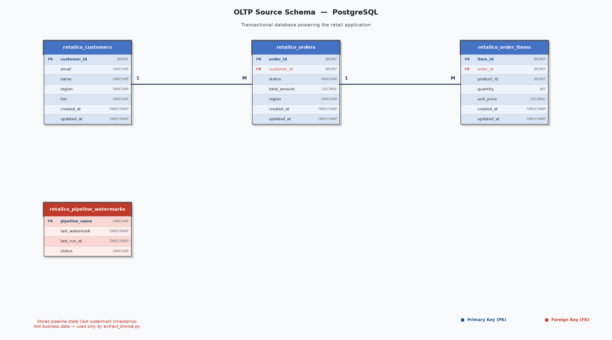
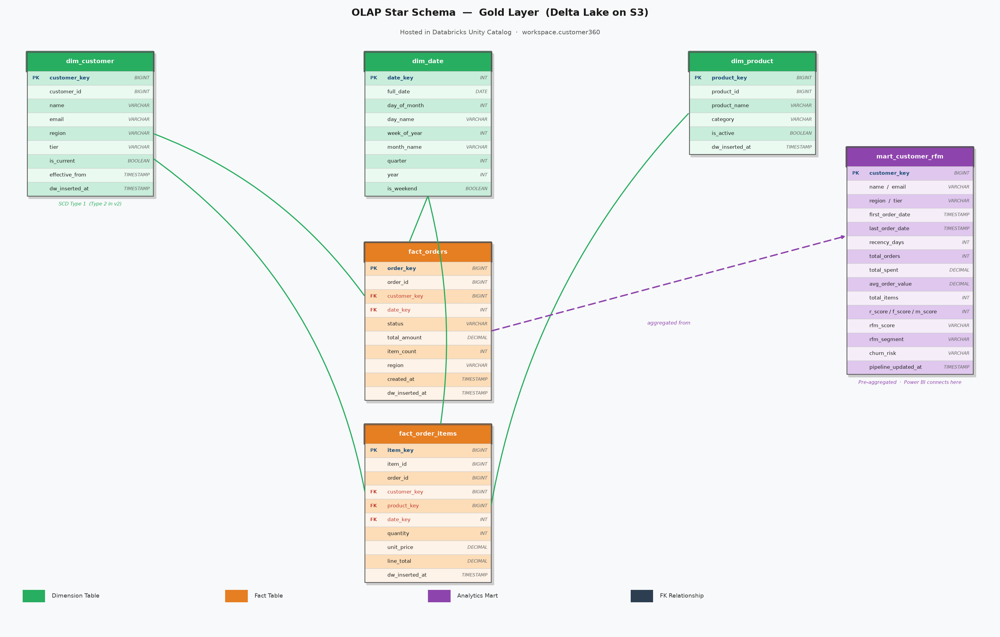

# Customer 360 Data Platform

An end-to-end data engineering pipeline that ingests raw retail transactions from PostgreSQL, processes them through a Medallion Architecture on AWS S3 with Delta Lake, and delivers an RFM-scored customer analytics mart — queryable via Databricks SQL and ready for Power BI.

---

## Architecture

```
┌─────────────┐     incremental extract      ┌──────────────────────────────────────────┐
│  PostgreSQL  │  ──────────────────────────► │              AWS S3                      │
│  (source)   │    high-water mark +          │                                          │
│             │    15-min overlap window      │  BRONZE  raw Parquet (append-only)       │
│  customers  │                               │    │                                     │
│  orders     │                               │    │  deduplicate + validate + MERGE      │
│  order_items│                               │    ▼                                     │
└─────────────┘                               │  SILVER  Delta Lake (ACID, idempotent)   │
                                              │    │                                     │
                                              │    │  star schema joins + RFM scoring    │
                                              │    ▼                                     │
                                              │  GOLD    Star Schema + Analytics Mart    │
                                              └──────────────┬───────────────────────────┘
                                                             │
                                                  ┌──────────┴──────────┐
                                                  │   Databricks SQL    │
                                                  │  (Unity Catalog)    │
                                                  └──────────┬──────────┘
                                                             │
                                                    ┌────────┴────────┐
                                                    │    Power BI     │
                                                    │   Dashboard     │
                                                    └─────────────────┘
```

---

## Data Models

### OLTP — PostgreSQL Source Schema


### OLAP — Gold Layer Star Schema (Delta Lake on S3)


---

## Tech Stack

| Component | Technology |
|---|---|
| Source database | PostgreSQL 14 |
| Object storage | AWS S3 |
| Bronze format | Parquet (partitioned by date) |
| Silver / Gold format | Delta Lake |
| Local transformation | Python, pandas, deltalake |
| Cloud transformation | Databricks SQL (serverless warehouse) |
| Cloud catalog | Unity Catalog (`workspace.customer360`) |
| Orchestration | Databricks Workflow (REST API) |
| Visualization | Power BI |

---

## Data Flow

### Bronze — Raw Landing
- Extracts **only changed rows** using a high-water mark stored in PostgreSQL
- 15-minute overlap window intentionally re-fetches recent rows to catch late arrivals
- Writes append-only Parquet to S3: `bronze/{table}/year=/month=/day=/batch_{ts}.parquet`
- Watermark advances **only after confirmed S3 write** — safe to kill and retry at any point

### Silver — Clean and Trusted
- Reads all Bronze Parquet files per table into memory
- Deduplicates: keeps latest `updated_at` per primary key (resolves overlap duplicates)
- Validates: drops rows with null PKs, negative amounts, invalid status/tier values
- MERGEs into Silver Delta tables (INSERT new, UPDATE changed)
- Running twice produces identical results — fully idempotent

### Gold — Star Schema
Three dimension tables and two fact tables built from Silver:

| Table | Grain | Rows |
|---|---|---|
| `dim_customer` | One row per customer (SCD Type 1) | 510 |
| `dim_product` | One row per product (synthetic, 200 products) | 200 |
| `dim_date` | One row per calendar day (2024–2027) | 1,461 |
| `fact_orders` | One row per order | 5,100 |
| `fact_order_items` | One row per order line item | 15,484 |

### Gold Mart — Analytics Ready
`mart_customer_rfm` — one row per customer with full RFM profile:

| Metric | Description |
|---|---|
| `recency_days` | Days since last order |
| `total_orders` | Lifetime order count |
| `total_spent` | Lifetime revenue |
| `r_score / f_score / m_score` | 1–5 percentile scores via NTILE ranking |
| `rfm_segment` | Champions, Loyal, At Risk, Lost, New Customers, etc. |
| `churn_risk` | HIGH (>90 days) / MEDIUM (31–90) / LOW (≤30) |

Power BI connects directly to this table — no joins at query time.

---

## Key Engineering Decisions

**Why incremental extraction with an overlap window?**
A strict watermark risks missing rows that were written slightly before the last batch completed. A 15-minute overlap re-fetches those rows. The MERGE in Silver resolves the resulting duplicates — no data loss, no data duplication.

**Why Delta Lake for Silver and Gold?**
Delta provides ACID transactions and MERGE semantics on S3, which plain Parquet cannot. MERGE is what makes the pipeline idempotent — the same Bronze data can be reprocessed without creating duplicates.

**Why a mart table instead of querying facts directly?**
Pre-aggregating RFM metrics at pipeline time means Power BI reads one flat table with no joins. Window functions (NTILE, rank) are expensive at dashboard query time; running them once in the pipeline is the right trade-off.

**Why SCD Type 1 for dim_customer?**
Current state is sufficient for RFM scoring and churn risk. Historical attribute tracking (SCD Type 2) is the natural next step when the use case requires it.

---

## Project Structure

```
customer-360-data-platform/
│
├── pipeline/                   Python ETL — runs locally against S3
│   ├── simulate_data.py        Inserts synthetic business activity into PostgreSQL
│   ├── extract_bronze.py       Incremental extract: PostgreSQL → S3 Bronze (Parquet)
│   ├── silver_transform.py     Deduplicate + validate + MERGE → S3 Silver (Delta)
│   ├── gold_dimensions.py      Build dim_customer, dim_product, dim_date
│   ├── gold_facts.py           Build fact_orders, fact_order_items
│   ├── gold_mart.py            Build mart_customer_rfm (RFM + churn risk)
│   └── experiments.py          Validation: incremental proof, idempotency, data quality
│
├── databricks/                 SQL pipeline — runs on Databricks serverless warehouse
│   ├── notebooks/
│   │   ├── 01_setup_bronze.sql     Register Bronze external tables from Volume
│   │   ├── 02_silver_transform.sql MERGE Bronze → Silver with deduplication
│   │   ├── 03_gold_dimensions.sql  Build Gold dimension tables
│   │   ├── 04_gold_facts.sql       Build Gold fact tables (star schema joins)
│   │   └── 05_gold_mart.sql        Build RFM mart with NTILE scoring + segments
│   ├── deploy_notebooks.py     Upload notebooks + create Databricks Workflow via API
│   ├── upload_to_volume.py     Sync S3 Bronze Parquet → Databricks Unity Catalog Volume
│   └── run_workflow.py         Trigger and poll the Databricks pipeline Workflow
│
├── setup/
│   └── setup_source_db.py      Creates PostgreSQL tables and loads synthetic seed data
│
├── config/
│   ├── config.template.yaml    Template — copy to config.yaml and fill credentials
│   └── config.yaml             Local only — gitignored, contains real credentials
│
├── architecture/
│   └── README.md               Layer contracts, failure recovery, scale decisions
│
├── requirements.txt
└── README.md
```

---

## Setup

**1. Clone and install dependencies**
```bash
git clone https://github.com/Techkrish1/customer-360-data-platform.git
cd customer-360-data-platform
pip install -r requirements.txt
```

**2. Configure credentials**
```bash
cp config/config.template.yaml config/config.yaml
# Edit config/config.yaml with your PostgreSQL, AWS S3, and Databricks credentials
```

**3. Initialize the source database**
```bash
python setup/setup_source_db.py
```

---

## Running the Pipeline

**Local pipeline (Python + S3)**
```bash
python pipeline/extract_bronze.py       # incremental extract
python pipeline/silver_transform.py     # clean + deduplicate
python pipeline/gold_dimensions.py      # build dimension tables
python pipeline/gold_facts.py           # build fact tables
python pipeline/gold_mart.py            # build RFM analytics mart
```

**Databricks SQL pipeline**
```bash
python databricks/upload_to_volume.py   # sync Bronze to Databricks Volume
python databricks/run_workflow.py       # trigger and poll Databricks Workflow
```

**Simulate new business activity (for testing incremental behavior)**
```bash
python pipeline/simulate_data.py        # inserts new orders, transitions statuses
```

---

## Pipeline Validation

`experiments.py` runs three measurable tests:

| Experiment | What it proves |
|---|---|
| **A — Incremental proof** | Simulate 10 new orders; Bronze picks up only those rows, not the full 5,000 |
| **B — Idempotency** | Run Silver → Gold twice with no new data; row counts are identical both runs |
| **C — Data quality** | Inject bad rows (negative amount, invalid status); Silver blocks all of them |

```bash
python pipeline/experiments.py
```

---

## Measured Results

| Run | Bronze rows extracted | Incremental? |
|---|---|---|
| First run (full load) | 21,094 | No (baseline) |
| Second run (incremental) | 272 | Yes — 98.7% reduction |

272 duplicates from the overlap window resolved by Silver MERGE — zero duplicates reached Gold.
